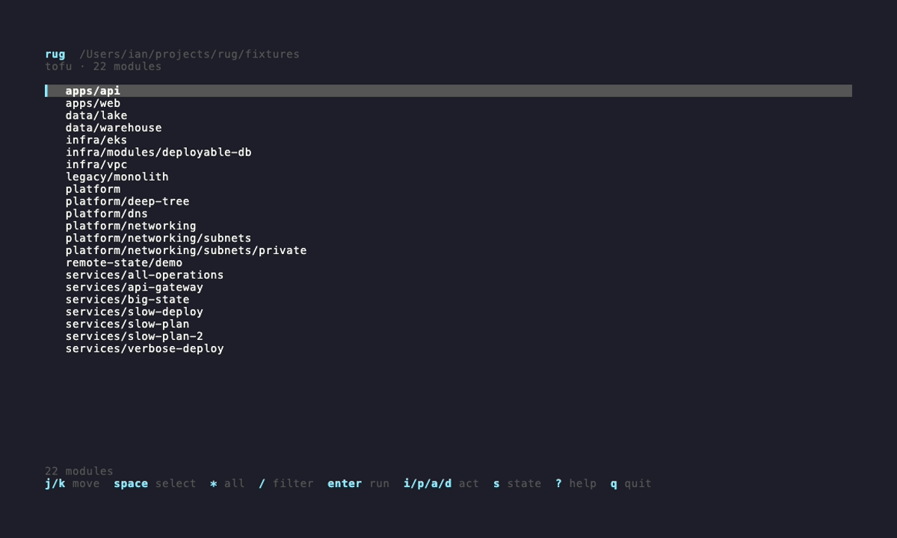
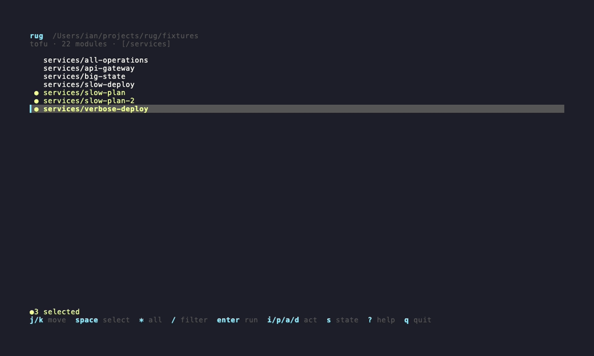
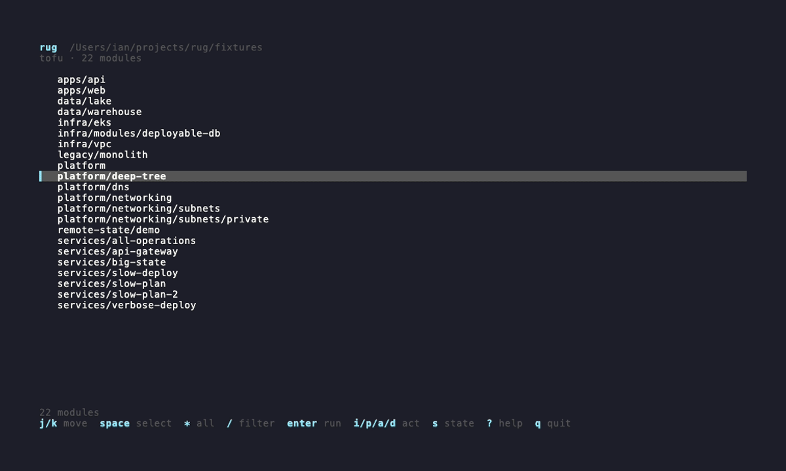
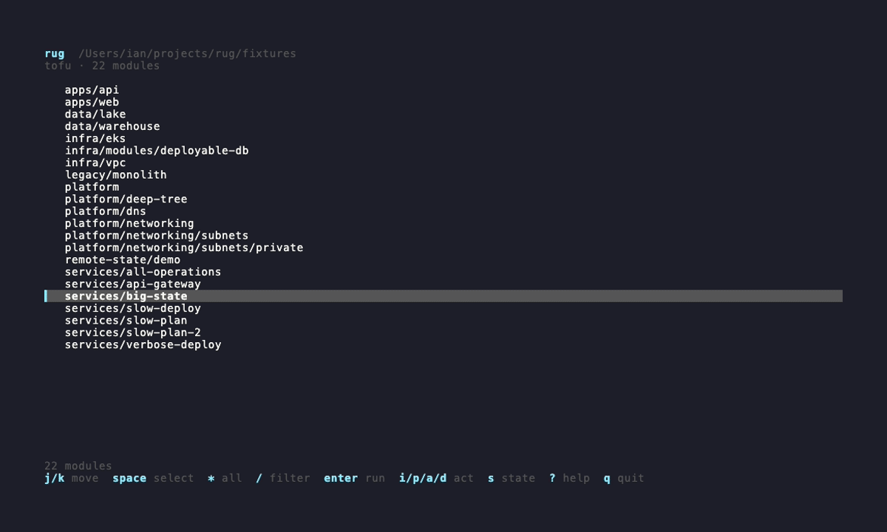
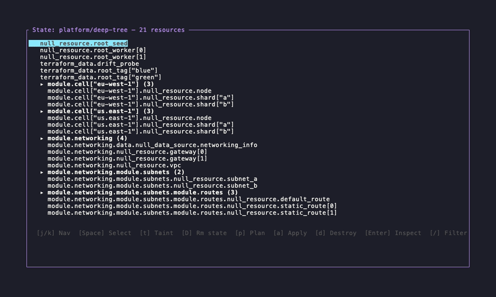

# rug — terraform/tofu multiplexer

**Run terraform/tofu across every module in your repo — in parallel, from one terminal.**

rug discovers the root modules under a directory tree and multiplexes commands
across them: an interactive TUI by default, a headless CLI for scripts and CI.


## Install

```sh
curl -fsSL https://raw.githubusercontent.com/terrabyteian/rug/master/install.sh | sh
```

Pin a specific version:

```sh
curl -fsSL https://raw.githubusercontent.com/terrabyteian/rug/master/install.sh | RUG_VERSION=v0.6.0 sh
```

The installer places the `rug` binary in `~/.local/bin` (override with `RUG_INSTALL_DIR`) — make sure that directory is on your `PATH`.

**Build from source** (requires Rust):

```sh
cargo install --path .
```

Then point it at your infrastructure:

```sh
rug                    # discover modules under the current directory
rug --dir infra/       # start from a specific root
```

## Features

Everything below is real output, recorded against the fixture tree in this repo.

### Pick your modules fast

Type `/` to narrow the list as you type, `Space` to mark modules, `*` to grab
everything visible, and `[` / `]` to fold the tree by depth. Scope a run across
a big monorepo in seconds — no cd-ing around.



### Watch every run, live

One board for the whole run: command, status, timing, and resource changes per
module, with the highlighted module's output streaming underneath. `Enter`
fullscreens the output. `C` cancels — an interrupt first, not a hard kill, so
terraform shuts down gracefully and releases its state lock.



*Cancelling only the marked task: the other two run to completion.*

### Apply the exact plan you reviewed

A successful plan is saved per module and badged `P:{age}`. Apply consumes that
saved plan file instead of re-planning, and the confirm dialog shows which plan
it will use and how old it is. No drift between what you reviewed and what ships.



### Browse state without leaving the terminal

Press `s` on any module to open the state explorer: resources grouped by child
module, tainted resources flagged, `/` filtering by address, and `Enter` to
inspect any resource's attributes as highlighted JSON.



### Target exactly what you mean

In the explorer, `Space` on a module header selects the whole module as a single
`-target=`. Targeted plans land on the task board like any other task, and
applying a targeted cached plan warns you and lists precisely which addresses it
covers — nothing sneaks in.



*The `·T{n}` chip on a task counts its `-target=` addresses.*

### Also in the box

- **Force-unlock** — `U` reads the lock's holder and id from the module's state
  lock and clears it after a confirm.
- **Copy output anywhere** — drag to select in the output pane (auto-copies on
  release), `y`/`Y` re-copy; OSC 52 means copying works over SSH and inside
  tmux or zellij. See [key bindings](#tui-key-bindings).
- **Output wrap** — `w` toggles character wrap in the output pane.
- **Library modules** — `--show-library` also lists modules with no
  backend/state signals.
- **One config, any depth** — a single `rug.toml` at the repo root applies no
  matter where you run from. See [Configuration](#configuration).
- **Arbitrary subcommands** — `rug exec validate --all` runs anything the
  binary supports.

## Headless mode

The same engine without the UI: output streams with a per-module prefix, and
the exit code tells CI what happened.


`--dir` must come **before** the subcommand.

### Headless subcommands

| Subcommand | What it runs | Notes |
|---|---|---|
| `init` | `terraform init` | |
| `plan` | `terraform plan` | |
| `apply` | `terraform apply -auto-approve` | prompts for confirmation unless `-y` |
| `destroy` | `terraform destroy -auto-approve` | prompts for confirmation unless `-y` |
| `exec <cmd> [args...]` | arbitrary subcommand | |
| `list` | prints the config file in use and discovered modules, then exits | |

**Common flags** (init/plan/apply/destroy/exec):

| Flag | Description |
|---|---|
| `--all` | Run on all discovered root modules |
| `--filter <string>` | Only run on modules whose path contains this substring |
| `-y` / `--yes` | Skip confirmation prompt (apply and destroy) |

**Examples:**

```sh
rug --dir infra/ plan --all
rug --dir infra/ apply --filter vpc -y
rug --dir infra/ exec validate --all
rug --dir infra/ list
```

**Exit codes:** rug exits `0` when every task succeeds, and `1` when any task
fails or no modules match the filter — a failed plan fails the pipeline.

## Configuration

rug reads `rug.toml` from the start directory (`--dir`, defaulting to the
current directory) or the nearest ancestor that has one, stopping at the
repository root (the directory holding `.git`) or your home directory — so one
`rug.toml` at the top of the repo applies at any depth, and an unrelated
project's config further up is never picked up. `rug list` prints which file
was used; a `rug.toml` that exists but can't be parsed is an error rather than
being ignored.

All fields are optional:

```toml
# Path to the terraform/tofu binary.
# Overridden by TF_BINARY env var; auto-detected if omitted.
binary = "tofu"

# Maximum number of concurrent terraform processes (default: 4).
parallelism = 4

# Directories to skip during module discovery.
ignore_dirs = [".terraform", ".git", "node_modules", ".terragrunt-cache"]

# Show library modules (no backend/lock signals) in the TUI (default: false).
show_library_modules = false
```

**Binary detection priority:**

1. `TF_BINARY` environment variable
2. `binary` field in `rug.toml`
3. `tofu` on PATH
4. `terraform` on PATH

## TUI key bindings

The TUI has two screens. The **Select** screen is a full-window module picker;
`Enter` (or any action key) moves to the **Run** screen — a status board with a
live output pane for the highlighted module. Actions on the Run screen apply to
the whole session or a marked subset; the `Shift` variant targets just the
highlighted row. `Esc` returns to Select while tasks keep running; `Tab` jumps
back into the running session. The minimum usable terminal size is 40×10.

**Select screen**

| Key | Action |
|---|---|
| `j` / `k` / `↑` / `↓` | Move cursor |
| `PgUp` / `PgDn` | Page up / down |
| `g` / `G` | Jump to first / last |
| `Space` | Toggle multi-select |
| `Ctrl+Space` | Range-select |
| `*` / `c` | Select all visible / clear selection |
| `/` | Filter modules by name (`Enter` keep, `Esc` clear) |
| `Esc` | Clear the applied filter |
| `[` / `]` | Decrease / increase depth |
| `Enter` | Run the current selection |
| `Tab` | Resume the existing run session |
| `i` / `u` | Init / init `-upgrade` |
| `p` / `a` | Plan / apply |
| `d` / `U` | Destroy / force-unlock |
| `s` | State explorer for the highlighted module |
| `r` / `R` | Refresh modules / reset session |
| `?` | Help |
| `q` / `Ctrl-C` | Quit |

**Run screen**

| Key | Action |
|---|---|
| `j` / `k` / `↑` / `↓` | Move board cursor |
| `g` / `G` | Jump to first / last |
| `PgUp` / `PgDn` | Scroll output pane |
| `Space` | Toggle row in the board subset |
| `Ctrl+Space` | Range-select rows |
| `*` / `c` | Select all rows / clear subset |
| `i` / `p` / `a` / `d` | Init / plan / apply / destroy (subset, or all if none marked) |
| `I` / `P` / `A` / `D` | Same, highlighted row only |
| `u` / `U` | Init `-upgrade` / force-unlock |
| `C` | Cancel active tasks in scope |
| `x` | Clear completed task history |
| Mouse drag | Select output text (copied to clipboard on release) |
| Mouse click | Clear the current selection |
| `y` | Re-copy current text selection |
| `Y` | Copy the whole output of the highlighted task |
| `Enter` | Fullscreen output |
| `w` | Toggle output wrap |
| `s` | State explorer for the highlighted module |
| `Esc` | Clear an active selection, then back to Select / exit fullscreen |
| `?` | Help |
| `q` / `Ctrl-C` | Quit |

Selected text is copied two ways at once: to the system clipboard, and as an
OSC 52 escape so the copy also works over SSH and inside tmux
(`set -g set-clipboard on`) or zellij, provided your terminal supports OSC 52.
To use the terminal emulator's native selection instead, hold `Shift` while
dragging. Output wrap (`w`) breaks lines at character boundaries. A plain
click (no drag) never starts a selection — it only clears the current one.

**State explorer**

Resources are grouped by child module: a header row like `▸ module.net (3)`
sits above its indented member resources. `Space` on a header selects the whole
module as a single `-target=`; on a resource it selects that resource alone.
Targeted operations act on the current selection, or the highlighted row if
nothing is selected.

| Key | Action |
|---|---|
| `j` / `k` / `↑` / `↓` | Move cursor |
| `Enter` | Inspect resource attributes (no-op on header rows) |
| `Space` | Select resource — or the whole module on a header row |
| `c` | Clear selection |
| `/` | Filter resources by address |
| `p` | Targeted plan (`plan -target=…`) |
| `a` | Targeted apply (`apply -target=…`, with confirmation) |
| `d` | Targeted destroy (`destroy -target=…`, with confirmation) |
| `t` | Taint (module selections expand to member resources; data sources skipped) |
| `D` | Remove from state (`state rm`, accepts module addresses) |
| `r` | Refresh state |
| `Esc` / `q` | Close |

Operations launched from the state explorer appear on the Run screen task
board, joining the existing session or creating one. A targeted task shows a
`·T{n}` count next to its command (e.g. `apply·T2`), where `n` is the number of
`-target=` addresses. A module's cached-plan badge gets the same suffix when
the plan was targeted — `P:{age}·T{n}` — and applying such a plan warns you in
the confirm dialog and lists exactly which addresses the apply covers. Targeted
apply and destroy launched from the explorer run `-target=…` directly and never
consume the cached plan.

## Supported platforms

| OS | Architecture |
|---|---|
| macOS | arm64 |
| Linux | x86_64 |
| Linux | arm64 |

Intel Macs can run the arm64 binary via Rosetta 2.
